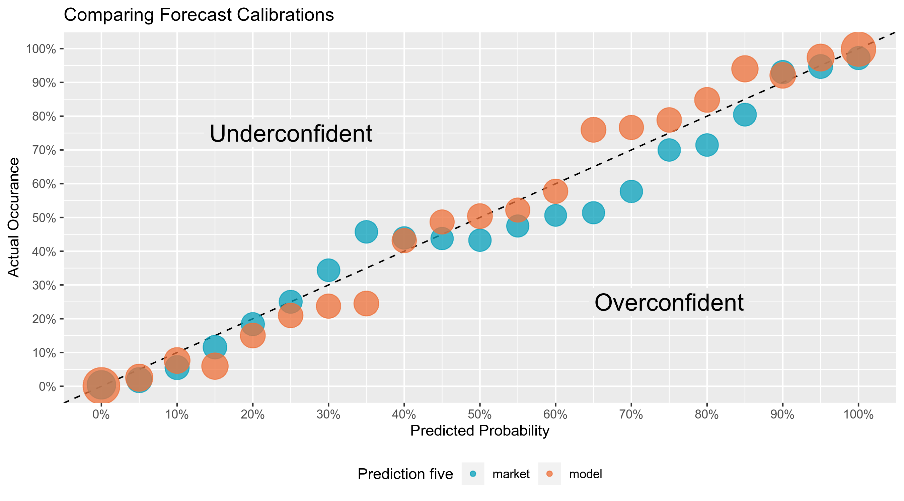
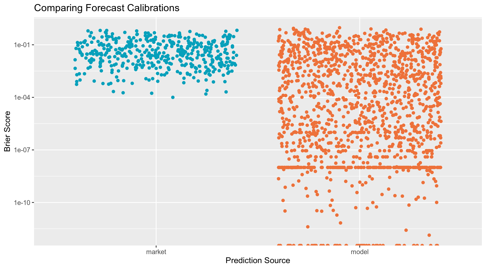

Simulating the 2020 Electoral College With Prediction Markets
================

  - [Background](#background)
  - [Background](#background-1)
  - [Process](#process)
  - [Models](#models)
  - [Markets](#markets)
  - [Calibrate](#calibrate)

## Background

## Background

Election prediction helps party officials, campaign operatives, and
journalists interpret campaigns in a quantitative manner. Understanding
trends, uncertainty, and likely outcomes is in invaluable political
tool. For this reason, elections will always be predicted. In the
absense of numbers, people will latch on to whatever predictive tool
they can find. The [stock market](https://on.mktw.net/2Zd8QOU), [key
incumbency factors](http://wapo.st/2eUm8cv), the [Washington
Redskins](https://en.wikipedia.org/wiki/Redskins_Rule), [Halloween mask
sales](https://www.thrillist.com/news/nation/halloween-mask-sales-predict-the-presidential-election),
and a [psychic Chinese monkeys](http://wapo.st/2fnlPr3).

In the past few years, as “[big
data](https://en.wikipedia.org/wiki/Big_data)” has sought to supplant
traditional arbitrary punditry, the statistical forecasting model has
become a staple of electioneering. Popularized by the data journalist at
[FiveThirtyEight](https://fivethirtyeight.com/), the forecasting model
is a statistical tool used to incorporate a number of quantitative
inputs and produce a *probabilistic* view of all possible outcomes.

However, following the 2016 Presidential election, much of the public
felt betrayed by the promise of data to seemingly predict the future. As
explained in [*An Evaluation of 2016 Election Polls in the
U.S.*](https://www.aapor.org/Education-Resources/Reports/An-Evaluation-of-2016-Election-Polls-in-the-U-S.aspx)
by the [American Association for Public Opinion
Research’s](https://www.aapor.org/) (AAPOR) Ad Hoc Committee on 2016
Election Polling:

> The 2016 presidential election was a jarring event for polling in the
> United States. Pre-election polls fueled high-profile predictions that
> Hillary Clinton’s likelihood of winning the presidency was about 90
> percent, with estimates ranging from 71 to over 99 percent. When
> Donald Trump was declared the winner of the presidency in the early
> hours of November 9th, it came as a shock even to his own pollsters
> (Jacobs and House 2016). There was (and continues to be) widespread
> consensus that the polls failed.

This “widespread consensus” was expressed by the new President-elect,
vindicated Republican voters, stunned Democratic voters, academics, and
journalists alike. This doubt in the polls was a reasonable knee jerk
reaction on election night, when it became clear Trump would win. Some
even went as far as to [cast the suprise upset as the end of scientific
polling in
America](https://thehill.com/blogs/ballot-box/presidential-races/305133-pollsters-suffer-huge-embarrassment):

> Pollsters and election modelers suffered an industry-shattering
> embarrassment at the hands of Donald Trump on Tuesday night. Trump,
> the Republican presidential nominee, had long said the polls were
> biased against him. His claims — dismissed and mocked by the experts —
> turned out to be true. “It’s going to put the polling industry out of
> business,” said CNN anchor Jake Tapper. “It’s going to put the voter
> projection industry out of business.” Going into Election Day, a
> strong majority of pollsters and election modelers forecast that
> Democrat Hillary Clinton would coast to victory, with many predicting
> she would sweep the battlegrounds and win north of 300 electoral
> votes… Whatever the reason, pollsters will have to reassess after a
> dismal showing in 2016 that produced a result almost no one foresaw.

And while the AAPOR report was ultimately quite dismissive of the
general reaction to election forcasting, I think it’s still worthwhile
exploring the role probabalistic forecasting should play in American
politics going forward. It’s quite obvious to me that all forecasting
should still be rooted in mathematics; it would be a shame to revert
back towards reliance on pundits for our forecasting. Non-mathematic
forecasts might do more harm than good. However, I am particuarly
interested in exploring what *other* types of mathematics might play a
role in election forcasting. Today we are going to compare the
mathematics of economics vs statistics in their ability to predict
elections.

Prediction markets can be used to generate similarly probabilistic views
of election outcomes by utilizing the economic forces of price discovery
and risk aversion to overcome the ideological bias of self-interested
traders on a binary options exchange. Traders use real money to buy
shares of [futures
contracts](https://en.wikipedia.org/wiki/Futures_contract) tied to an
outcome. The price of these shares fluctuates on the market as the
underlying *likelihood* of that outcome changes.
[PredictIt](https://www.predictit.org/) is an exchange for such
contracts, run by Victoria University of Wellington.

Following the 2018 Midterm elections, [I wrote a
paper](https://github.com/kiernann/models-markets) comparing these
markets to the congressional model published by the data journalists at
FiveThirtyEight. I found no statistical difference in the two method’s
ability to make [skilled
predictions](https://en.wikipedia.org/wiki/Brier_score) over the course
of the Midterm elections. In fact, the markets showed reasonable
skepticism in a number of upset elections. Below, you can see how
competitive Congressonal races were predicted by both the markets and
model.

This summer, [FiveThirtyEight released a comprehensive
review](https://projects.fivethirtyeight.com/checking-our-work/) of all
forecats made in the last decade. In this article, they ask a
fundamental question: How good are FiveThirtyEight forecasts?

> Forecasts have always been a core part of FiveThirtyEight’s mission.
> They force us (and you) to think about the world probabilistically,
> rather than in absolutes. And making predictions, whether we’re
> modeling a candidate’s chance of being elected or a team’s odds of
> making the playoffs, improves our understanding of the world by
> testing our knowledge of how it works — what makes a team or a
> candidate win. But are those forecasts any good? This project seeks to
> answer that question.

As a part of this project, FiveThirtyEight took the comendable step of
releasing a public dataset containg daily predictions on over 1,500
different events. I will be comparing their comendable track record
against the the available data from a leading prediction market.

## Process

I’ll be using the open source [language R](https://www.r-project.org/)
and packages from the [Tidyverse ecosystem](https://www.tidyverse.org/).

``` r
if (!require("pacman")) install.packages("pacman")
pacman::p_load_gh("irworkshop/campfin", "kiernann/predictr")
pacman::p_load(tidyverse, lubridate, magrittr, janitor, fs)
```

## Models

We can download the FiveThirtyEight dataset directly from their [GitHub
repository](https://github.com/fivethirtyeight/checking-our-work-data).

``` r
zip_url <- "https://github.com/fivethirtyeight/checking-our-work-data/raw/master/raw_forecasts.zip"
zip_file <- basename(zip_url)
download.file(url = zip_url, destfile = zip_file)
unzip(zipfile = zip_file)
```

Then, read the file into R with `readr::read_csv`. We’ll then use
`dplyr::filter()` to keep only political predictions.

``` r
model_history <- 
  read_csv(
    file = "raw_forecasts.csv",
    col_types = cols(
      .default = col_guess(),
      forecast_date = col_character(),
      outcome = col_character(),
      live_info = col_character()
    )
  ) %>%
  filter(
    topic == "politics"
  ) %>% 
  mutate(
    outcome = outcome %>% 
      str_sub(end = 1) %>% 
      parse_logical(),
    forecast_date = forecast_date %>% 
      str_sub(end = 10) %>% 
      parse_date("%Y-%m-%d"),
    diff_date = event_date %>% 
      subtract(forecast_date)
  ) 
```

``` r
glimpse(sample_frac(model_history))
#> Observations: 520,135
#> Variables: 15
#> $ topic         <chr> "politics", "politics", "politics", "politics", "politics", "politics", "p…
#> $ category      <chr> "house", "house", "house", "house", "president", "house", "senate", "senat…
#> $ project       <chr> "district-house", "district-house", "district-house", "district-house", "s…
#> $ event         <chr> "House: NC-12", "House: WA-5", "House: NC-2", "House: GA-7", "President: M…
#> $ year          <dbl> 2018, 2018, 2018, 2018, 2016, 2018, 2018, 2016, 2018, 2018, 2016, 2018, 20…
#> $ entity        <chr> "Alma Adams (D)", "Lisa Brown (D)", "Linda Coleman (D)", "Rob Woodall (R)"…
#> $ event_date    <date> 2018-11-06, 2018-11-06, 2018-11-06, 2018-11-06, 2016-11-08, 2018-11-06, 2…
#> $ forecast_date <date> 2018-08-29, 2018-09-30, 2018-09-24, 2018-10-12, 2016-11-08, 2018-11-06, 2…
#> $ forecast_type <chr> "deluxe", "deluxe", "classic", "lite", "live", "live", "lite", "polls-plus…
#> $ live_info     <chr> NA, NA, NA, NA, NA, NA, NA, NA, NA, NA, NA, NA, NA, NA, NA, NA, NA, NA, NA…
#> $ field         <chr> "winprob", "winprob", "winprob", "winprob", "winprob", "winprob", "winprob…
#> $ prob          <dbl> 0.9999800, 0.2095600, 0.3256600, 0.8043800, 0.0197833, 0.0051000, 0.030000…
#> $ bucket        <dbl> 1.00, 0.20, 0.35, 0.80, 0.00, 0.00, 0.05, 0.55, 0.00, 1.00, 0.00, 0.65, 0.…
#> $ outcome       <lgl> TRUE, FALSE, FALSE, TRUE, FALSE, FALSE, FALSE, TRUE, FALSE, TRUE, FALSE, T…
#> $ diff_date     <drtn> 69 days, 37 days, 43 days, 25 days, 0 days, 0 days, 12 days, 116 days, 85…
```

## Markets

To collected market history data, we first have to start with a list of
closed markets, provided to me by PredictIt. Using this list, we can
filter to keep only those markets containg “win” or “election” in the
market question.

``` r
election_markets <-
  read_csv(
    file = "closed_markets.csv",
    col_types = cols(
      .default = col_guess(),
      id = col_character()
    )
  ) %>% 
  filter(
    str_detect(market, rx_break("win")) |
    str_detect(market, rx_break("election"))
  )
```

``` r
rng <- sample(seq(1, nrow(election_markets)), 10)
paste("* ", election_markets$market[rng]) %>% cat(sep = "\n")
```

  - Will Moore win Jefferson County in Alabama’s special Senate
    election?
  - Who will win the New Jersey Republican gubernatorial primary?
  - Who will win the 2018 Democratic primary for Illinois’ 14th
    District?
  - Which party will win the gubernatorial race in Kentucky in 2015?
  - What will be the margin of victory in the Czech legislative
    election?
  - Who will win the Maryland Democratic primary for U.S. Senate?
  - Which party will win Idaho in the 2016 presidential election?
  - Will George Holding win the Republican primary for North Carolina’s
    2nd District?
  - Who will win the 2018 Democratic primary for Illinois’ 4th District?
  - Who will win the Kansas Republican caucuses?

<!-- end list -->

``` r
market_history <- tibble()
for (id in election_markets$id) {
  market_history <- bind_rows(
    market_history,
    market_history(id)
  )
}
```

``` r
market_history
#> # A tibble: 88,546 x 8
#>    mid   contract date        open  high   low close   vol
#>    <chr> <chr>    <date>     <dbl> <dbl> <dbl> <dbl> <dbl>
#>  1 4558  Anaya    2018-06-26  0.8   0.8   0.8  0.8       3
#>  2 4558  Meade    2018-06-27  0.2   0.21  0.2  0.21    107
#>  3 4558  AMLO     2018-06-27  0.03  0.03  0.03 0.03    122
#>  4 4558  Anaya    2018-06-27  0.8   0.8   0.67 0.74    607
#>  5 4558  Meade    2018-06-28  0.21  0.31  0.15 0.24   1559
#>  6 4558  AMLO     2018-06-28  0.03  0.07  0.02 0.03   1830
#>  7 4558  Anaya    2018-06-28  0.74  0.85  0.68 0.71   1641
#>  8 4558  Meade    2018-06-29  0.24  0.25  0.16 0.21   1656
#>  9 4558  AMLO     2018-06-29  0.03  0.04  0.02 0.02    732
#> 10 4558  Anaya    2018-06-29  0.71  0.9   0.71 0.780  2139
#> # … with 88,536 more rows
```

``` r
market_history <- right_join(
  x = election_markets,
  y = market_history,
  by = c("id" = "mid")
)
```

``` r
market_outcomes <- market_history %>%
  group_by(id, contract) %>%
  arrange(desc(date)) %>%
  slice(1) %>%
  mutate(
    yes = close >= 0.98,
    no = close <= 0.2
  ) %>%
  select(id, contract, yes)
```

## Calibrate

``` r
market_calib <-
  left_join(market_history, market_outcomes) %>%
  mutate(bucket = round(close * 20) / 20) %>%
  group_by(bucket) %>%
  summarise(prop = mean(yes), n = n()) %>%
  mutate(source = "market") %>%
  select(source, everything())
```

``` r
model_calib <- model_history %>%
  filter(topic == "politics") %>%
  group_by(bucket) %>%
  summarize(prop = mean(outcome), n = n()) %>%
  mutate(source = "model") %>%
  select(source, everything())
```

``` r
bind_rows(
  market_calib,
  model_calib
) %>%
  ggplot(aes(x = bucket, y = prop)) +
  geom_abline(slope = 1, intercept = 0, linetype = 2) +
  geom_point(aes(color = source, size = n), alpha = 0.75) +
  scale_size_continuous(range = c(7, 12), guide = FALSE) +
  geom_label(mapping = aes(label = "Underconfident", x = 0.25, y = 0.75),
             label.size = 0,
             fill = "#ebebeb",
             size = 6) +
  geom_label(mapping = aes(label = "Overconfident", x = 0.75, y = 0.25),
             label.size = 0,
             fill = "#ebebeb",
             size = 6) +
  scale_color_manual(values = c("#07A0BB", "#ED713A")) +
  scale_x_continuous(labels = scales::percent, breaks = seq(0, 1, by = 0.1)) +
  scale_y_continuous(labels = scales::percent,  breaks = seq(0, 1, by = 0.1)) +
  theme(legend.position = "bottom") +
  labs(
    title = "Comparing Forecast Calibrations",
    x = "Predicted Probability",
    y = "Actual Occurance",
    color = "Prediction five"
  )
```

<!-- -->

``` r
x <- market_history %>% 
  left_join(market_outcomes) %>% 
  select(ticker, close, yes) %>% 
  group_by(ticker) %>% 
  summarise(brier = mean((close - yes)^2)) %>% 
  mutate(source = "market") %>% 
  select(source, event = ticker, brier)

y <- model_history %>% 
  group_by(event, year) %>% 
  summarise(brier = mean((prob - outcome)^2)) %>% 
  mutate(source = "model") %>% 
  select(source, event, brier)

bind_rows(x, y) %>% 
  ggplot(aes(x = source, y = brier)) +
  geom_jitter(aes(color = source)) +
  scale_y_log10() +
  scale_color_manual(values = c("#07A0BB", "#ED713A"), guide = FALSE) +
  labs(
    title = "Comparing Forecast Calibrations",
    x = "Prediction Source",
    y = "Brier Score"
  )
```

<!-- -->
