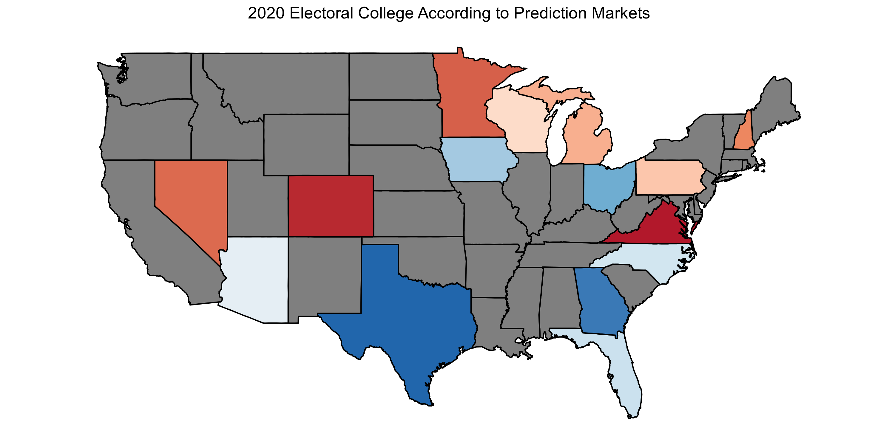

Texas Expenditures
================
Kiernan Nicholls
2019-08-21 19:31:09

Election prediction helps party officials, campaign operatives, and
journalists interpret campaigns in a quantitative manner. Uncertainty is
key to a useful election prediction.

The forecast model has become a staple of political punditry.
Popularized by the data journalist at FiveThirtyEight, the forecasting
model is a statistical tool used to incorporate a number of quantitative
inputs and produce a *probabilistic* view of all possible outcomes.

Prediction markets can be used to generate similarly probabilistic views
of election outcomes by utilizing the economic forces of price discovery
and risk aversion to overcome the ideological bias of self-interested
traders on a binary options exchange.

Can we possibly use these prediction markets to generate a useful
probabalistic simulation of the electoral college? We’ll try and use
data from the PredictIt exchange and R code to answer this question.

PredictIt hosts markets for most of the contenious battleground states.
We can scrape these markets using their API and the `jsonlite` package.

``` r
api_url <- "https://www.predictit.org/api/marketdata/all/"
market_title <- "Which party will win (.*) in the 2020 presidential election?"
ec_markets <-
  fromJSON(txt = api_url) %>%
  use_series(markets) %>%
  filter(name %>% str_detect(market_title)) %>%
  unnest(contracts, names_repair = make_clean_names) %>%
  filter(short_name_2 == "Democratic") %>%
  select(state = short_name, price = last_close_price) %>%
  mutate(state = str_extract(state, "[:upper:]{2}")) %>% 
  arrange(price)
```

<!-- -->
