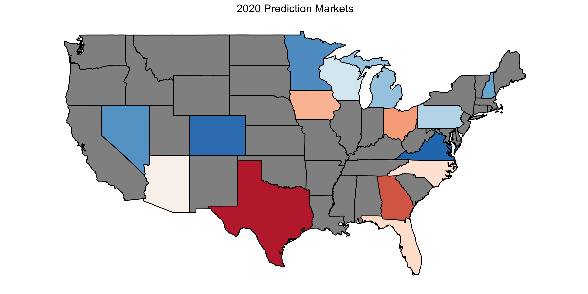
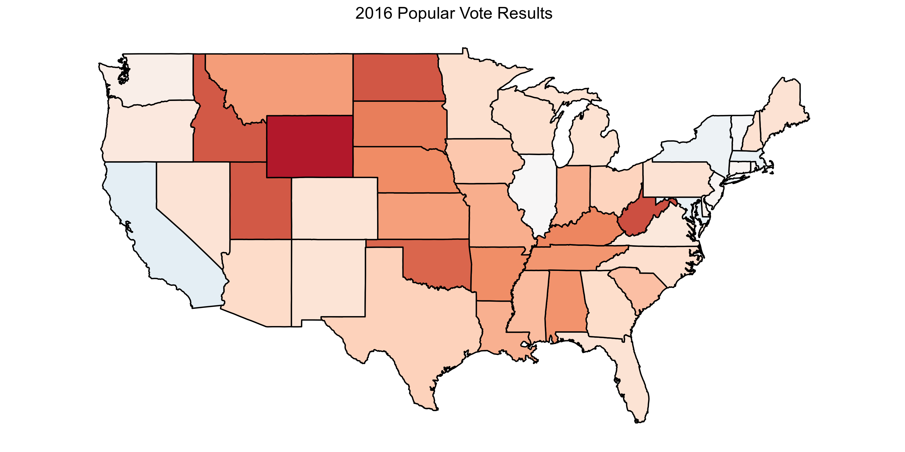
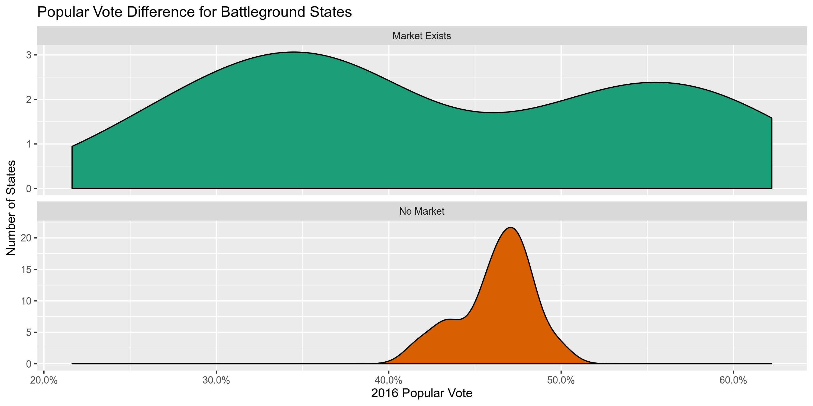
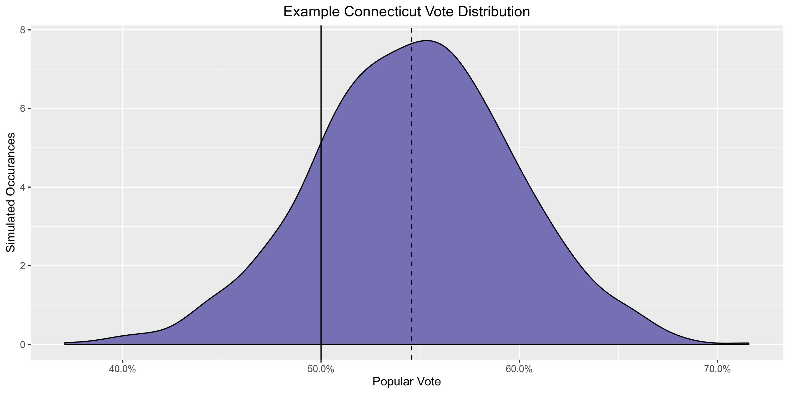
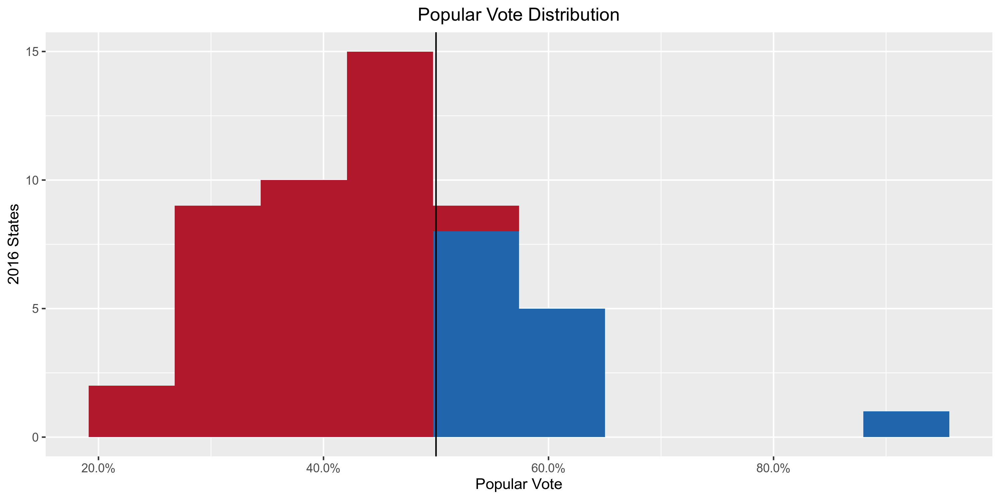
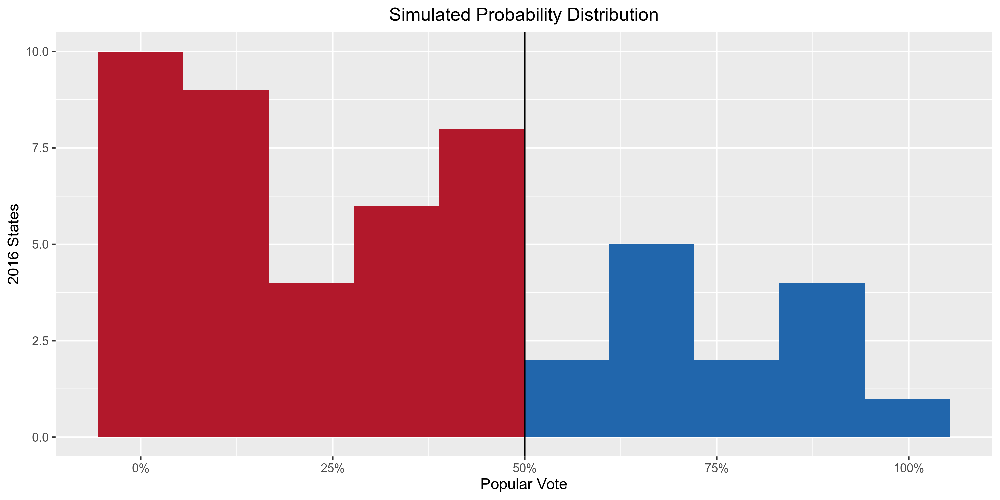

Simulating 2020 Using Markets
================

  - [Market Data](#market-data)
  - [Historical Data](#historical-data)
  - [Probabilities](#probabilities)

Election prediction helps party officials, campaign operatives, and
journalists interpret campaigns in a quantitative manner. Uncertainty is
key to a useful election prediction.

The forecast model has become a staple of political punditry.
Popularized by the data journalist at FiveThirtyEight, the forecasting
model is a statistical tool used to incorporate a number of quantitative
inputs and produce a *probabilistic* view of all possible outcomes.

Prediction markets can be used to generate similarly probabilistic views
of election outcomes by utilizing the economic forces of price discovery
and risk aversion to overcome the ideological bias of self-interested
traders on a binary options exchange.

Can we possibly use these prediction markets to generate a useful
probabalistic simulation of the electoral college? We’ll try and use
data from the PredictIt exchange and R code to answer this question.

``` r
if (!require("pacman")) install.packages("pacman")
pacman::p_load_current_gh("kiernann/campfin")
pacman::p_load(
  tidyverse,
  jsonlite,
  magrittr,
  janitor,
  rvest,
  usmap
)
```

## Market Data

PredictIt hosts markets for most of the contenious battleground states.
We can scrape these markets using their API and the `jsonlite` package.

``` r
ec_markets <-
  fromJSON(txt = "https://www.predictit.org/api/marketdata/all/") %>%
  use_series(markets) %>%
  filter(str_detect(name, "Which party will win (.*) in the 2020 presidential election?")) %>%
  unnest(contracts, names_repair = make_clean_names) %>%
  filter(short_name_2 == "Democratic") %>%
  select(state = short_name, price = last_close_price) %>%
  mutate(state = str_extract(state, "[:upper:]{2}")) %>% 
  arrange(price)
```

<!-- -->

## Historical Data

To generate a full probabalistic view of the election, we’ll need to
calculate probabilities for those states for which there is not a
market. It’s incredibly reductive, but I’ll use 2016 data normally
distributed with a reasonable standard deviation. To make things simple,
we will ignore Maine and Nebraska’s congressional district
apportionment.

``` r
past_results <-
  read_html("https://en.wikipedia.org/wiki/2016_United_States_presidential_election") %>%
  html_node("table.wikitable:nth-child(1)") %>%
  html_table(fill = TRUE) %>%
  na_if("–") %>%
  as_tibble(.name_repair = "unique") %>%
  select(1, 4, 5, 8) %>%
  slice(-1, -58, -59) %>%
  set_names(c("state", "dem", "dem_votes", "rep_votes")) %>%
  map_dfc(parse_guess) %>% 
  mutate(
    votes = coalesce(dem_votes, rep_votes),
    dem = parse_double(str_remove(dem, "%"))/100,
    state = state %>% 
      str_remove("\\(at-lg\\)") %>% 
      str_remove(",\\s\\d..$") %>% 
      abrev_state()
  ) %>% 
  group_by(state) %>% 
  summarize(
    past = mean(dem),
    votes = sum(votes)
  )
```

<!-- -->

## Probabilities

Any good election forcast needs to be *probabalistic*. Professional
forecasts take this division of votes (usually from an aggrigate of
polls) then calculate the probablility distribution around that range
with a series of other factors.

For this simulation, we already have probabilities for 15 states.
PredictIt only hosts markets for the most contentious states. The
reality is the other 36 contests are fairly uncompetitive. From the
density plot below, we can see how the range of popular vote splits
differs for those states with 2020 markets and those without.

<!-- -->

To turn the 2016 vote share (e.g., 65%, 48%) into probabilities, we will
give each state a standard deviation of `0.05`. That means we can expect
that state to vote similarly to 2016, but give it a range of possible
values on either side. From the density plot of such a simulated
distribution, we can see that a state with a 65% vote in 2016 will win
over 50% *most* of the time. The area of the curve past 50% is the
probability of that win.

<!-- -->

We can perform such random normal simulations for each of the states
without a market to generate a probability from the 2016 vote. For each
state, we generate 100,000 simulate elections and calculate the percent
of those simulated elections where the democrat won.

``` r
past_results <- mutate(past_results, prob = NA)
for (i in seq_along(past_results$state)) {
  sims <- rnorm(n = 100000, mean = past_results$past[i], sd = 0.10)
  past_results$prob[i] <- mean(sims > 0.5)
}
```

<!-- -->

<!-- -->
