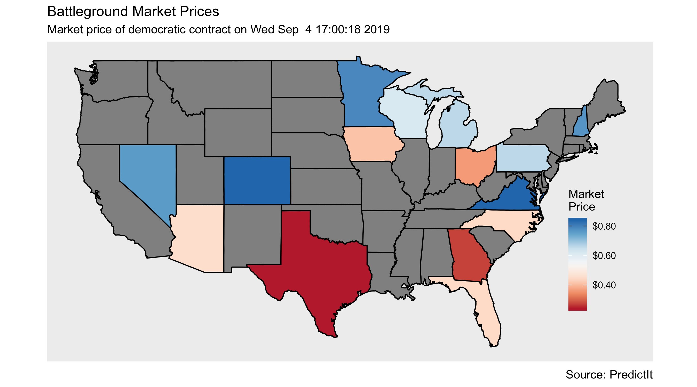
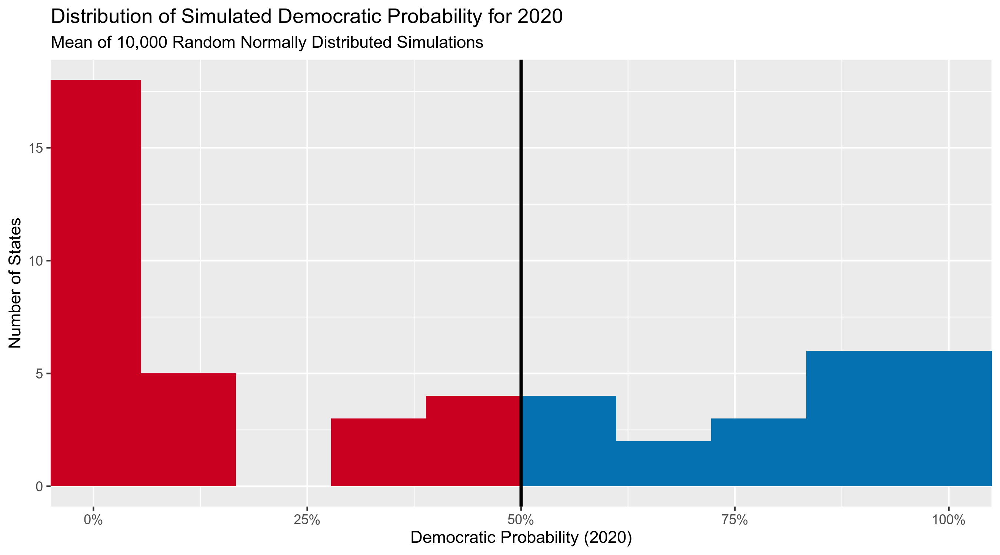

Simulating the 2020 Election With Markets
================

  - [Code](#code)
  - [Battleground Data](#battleground-data)
  - [Safe States](#safe-states)
  - [Probabilities](#probabilities)
  - [Combine Sources](#combine-sources)
  - [Electoral College](#electoral-college)
  - [Resources](#resources)

Election prediction helps party officials, campaign operatives, and
journalists interpret campaigns in a quantitative manner. Understanding
trends, uncertainty, and likely outcomes is in invaluable political
tool. For this reason, elections will always be predicted. In the
absense of numbers, people will latch on to whatever predictive tool
they can find. The [stock market](https://on.mktw.net/2Zd8QOU), [key
incumbency factors](http://wapo.st/2eUm8cv), the [Washington
Redskins](https://en.wikipedia.org/wiki/Redskins_Rule), [Halloween mask
sales](https://www.thrillist.com/news/nation/halloween-mask-sales-predict-the-presidential-election),
and a [psychic Chinese monkeys](http://wapo.st/2fnlPr3). If we’re going
to predict elections, we have a responsibility to make legitimate
quatitative predictions from scientifically founded bases.

In the past few years, as big data has sought to supplant arbitrary
punditry, the forecasting model has become a staple of political science
and journalism. Popularized by the data journalist at
[FiveThirtyEight](https://fivethirtyeight.com/), the forecasting model
is a statistical tool used to incorporate a number of quantitative
inputs and produce a *probabilistic* view of all possible outcomes.

However, following the 2016 Presidential election, the public ([perhaps
wrongly](https://www.r-project.org/)) felt betrayed by the promise of
data to predict the future. This left political scientists and
journalists alike reassessing other predictive tools. My favorite of
these alternatives is the prediction market.

Prediction markets can be used to generate similarly probabilistic views
of election outcomes by utilizing the economic forces of price discovery
and risk aversion to overcome the ideological bias of self-interested
traders on a binary options exchange. Traders use real money to buy
shares of [futures contracts](https://www.tidyverse.org/) tied to an
outcome. The price of these shares fluctuates on the market as the
underlying *likelihood* of that outcome changes.
[PredictIt](https://www.predictit.org/) is an exchange for such
contracts, run by Victoria University of Wellington.

Following the 2018 Midterm elections, [I wrote a
paper](https://github.com/kiernann/models-markets) comparing these
markets to the congressional model published by the data journalists at
FiveThirtyEight. I found no statistical difference in the two method’s
ability to make [skilled
predictions](https://en.wikipedia.org/wiki/Brier_score) over the course
of the Midterm elections. In fact, the markets showed reasonable
skepticism in a number of upset elections. Below, you can see how
competitive Congressonal races were predicted by both the markets and
model.


With the 2020 Presidential race well under way, the media, voters,
campaigns, and political scientists alike are all looking for the best
way to provide useful predictions and avoid the pitfalls of 2016. This
far from the General Election, what little polling we have [is less than
useless](https://53eig.ht/2IFHxVW). In the absense of more quantitative
data, can we possibly use prediction markets to generate a useful
probabilistic simulation of the electoral college? today I’ll try and
use data from the PredictIt exchange to answer this question.

## Code

I’ll be using the open source [language R](https://www.r-project.org/)
and packages from the [Tidyverse ecosystem](https://www.tidyverse.org/).

``` r
if (!require("pacman")) install.packages("pacman")
pacman::p_load_current_gh("kiernann/campfin")
pacman::p_load(tidyverse, dataverse, magrittr, jsonlite, scales, rvest)
```

## Battleground Data

PredictIt hosts markets for most of the competitive battleground states.
We can scrape these markets using their API and the
`jsonlite::fromJSON()` function.

Throughout this simulation, I’ll be using only the Democratic party
market prices, popular vote, and probability. This is a little
reductive, as it assumes this number alone can be used to calculate the
Republican party numbers, both of which will cover 100% of the
population. While third parties can be a real factor affecting American
politics, I will ignore them for now. A good forecasting method would
incorperate them. What we care most about here is the *plurality* of
votes in each state. The easiest way to calculate this is to find the
democratic share of the major party votes. If that share is greater than
50% then the democratic candidate likely won the plurality of votes.

``` r
market_prices <-
  fromJSON(txt = "https://www.predictit.org/api/marketdata/all/") %>%
  use_series(markets) %>%
  filter(str_detect(name, "Which party will win (.*) in the 2020 presidential election?")) %>%
  unnest(contracts, names_repair = "unique") %>%
  filter(shortName...11 == "Democratic") %>%
  select(state = shortName...3, price = lastTradePrice) %>%
  mutate(state = str_extract(state, "[:upper:]{2}")) %>% 
  arrange(price)
```

From this API, we get probability data for 15 battleground states.

<!-- -->

## Safe States

These states alone aren’t enough to simulate the 2020 electoral college.
To predict the remaining states, we have a few options. The easiest
route is to simply assume the party which won in 2016 will win again in
2020. This isn’t a terrible idea, as the majority of states rarely flip,
especially not the 35 states without a prediction market. We can start
from this assumption and improve upon it very easily.

### Past Elections

To calculate some simple probablistic predictions for the remaining
states, we will use data from the MIT Election Data and Science Lab,
which has a database of popular vote results in each state for every
Presidential election since 1976. This file can be read using
`dataverse::get_file()`.

``` r
past_elections <- get_file(
    file = "1976-2016-president.tab", 
    dataset = "doi:10.7910/DVN/42MVDX",
  ) %>% 
  read_csv(col_types = cols()) %>% 
  rename(votes = candidatevotes) %>% 
  filter(party %in% c("democrat", "republican"), writein == FALSE) %>% 
  group_by(year, state_po) %>% 
  mutate(prop = votes/sum(votes)) %>%
  filter(party == "democrat") %>% 
  select(year, state = state_po, prop)

# MIT Election Data and Science Lab, 2017, "1976-2016-president.tab"
# https://doi.org/10.7910/DVN/42MVDX/MFU99O, Harvard Dataverse, V5
```

This historical data provides two statistics needed to finish our
probablistic simulation. First, we have the democratic share of the vote
in the last election. Second, we can calculate the variation in the
party’s share of the vote in the last 11 elections.

``` r
state_sd <- past_elections %>% 
  group_by(state) %>% 
  summarize(sd = sd(prop))
```

``` r
left_join(usa_map, state_sd) %>%
  filter(state != "DC") %>% 
  ggplot(mapping = aes(x = long, y = lat, group = group)) +
  geom_polygon(color = "black", mapping = aes(fill = sd)) +
  coord_quickmap() +
  scale_fill_distiller(
    type = "seq", palette = 5, direction = 1
  ) +
  theme(
    legend.position = c(0.9, 0.35),
    panel.grid = element_blank(),
    axis.text  = element_blank(),
    axis.title = element_blank(),
    axis.ticks = element_blank(),
    legend.background = element_blank()
  ) +
  labs(
    title = "Variation in Democratic Share of Major Party Vote",
    subtitle = "Presidential Elections, 1976-2016",
    fill = "Standard\nDeviation",
    caption = "Source: MIT Election Data and Science Lab"
    )
```

<!-- -->

``` r
last_election <- past_elections %>% 
  filter(year == 2016)
```

<!-- -->

## Probabilities

Any good election forecast needs to be *probabilistic*. Professional
forecasts take this division of votes (usually from an aggregate of
polls) then calculate the probability distribution around that range
with a series of other factors.

For this simulation, we already have probabilities for 15 states.
PredictIt only hosts markets for the most competitive states. The
reality is, the other 36 contests are fairly noncompetitive. From the
density plot below, we can see how the 2016 popular vote differed for
those states *with* 2020 markets and those without.

<!-- -->

``` r
last_election <- last_election %>% 
  left_join(state_sd) %>%
  rowwise() %>% 
  mutate(prob = mean(rnorm(10000, prop, sd) > 0.50))
```

If we visualize this process, we can see how the 2016 result and a
standard deviation is used to simulate many elections and calculate a
probability.

Below you can see the results of 1,000 simulated elections in Maryland,
where of votes were cast for the Democratic candidate in the last
election. The area under the curve past 50% is the *probability* of a
democrat winning again in the next election.

<!-- -->

Now, lets see the distribution of 1,000 simulated elections in Florida,
a much closer election with only of voters supporting the democratic
candidate.

<!-- -->

We can generate this probability by calculating the average number of
simulated elections won by the democrat. Below, we see how this is done
by simulating the Connecticut election 60 times.

``` r
(ex_prop <- last_election$prop[last_election$state == "CT"])
#> [1] 0.5714155
(ex_sd <- last_election$sd[last_election$state == "CT"])
#> [1] 0.07423502
(ex_sims <- round(x = rnorm(n = 60, mean = ex_prop, sd = ex_sd), digits = 2))
#>  [1] 0.56 0.62 0.63 0.62 0.53 0.59 0.55 0.60 0.43 0.62 0.54 0.58 0.61 0.62 0.48 0.63 0.58 0.64 0.62
#> [20] 0.69 0.50 0.59 0.42 0.58 0.63 0.55 0.50 0.71 0.57 0.49 0.66 0.52 0.56 0.46 0.60 0.59 0.58 0.55
#> [39] 0.46 0.69 0.54 0.63 0.67 0.52 0.58 0.65 0.55 0.68 0.56 0.50 0.57 0.48 0.54 0.59 0.49 0.76 0.71
#> [58] 0.54 0.51 0.55
(ex_wins <- ex_sims > 0.5)
#>  [1]  TRUE  TRUE  TRUE  TRUE  TRUE  TRUE  TRUE  TRUE FALSE  TRUE  TRUE  TRUE  TRUE  TRUE FALSE
#> [16]  TRUE  TRUE  TRUE  TRUE  TRUE FALSE  TRUE FALSE  TRUE  TRUE  TRUE FALSE  TRUE  TRUE FALSE
#> [31]  TRUE  TRUE  TRUE FALSE  TRUE  TRUE  TRUE  TRUE FALSE  TRUE  TRUE  TRUE  TRUE  TRUE  TRUE
#> [46]  TRUE  TRUE  TRUE  TRUE FALSE  TRUE FALSE  TRUE  TRUE FALSE  TRUE  TRUE  TRUE  TRUE  TRUE
mean(ex_wins)
#> [1] 0.8166667
```

Below, you can see how the 2016 vote results result in more extreme
probabilities.

<!-- -->

<!-- -->

This relationship depends entirely on our chosen standard deviation.
Again, since we are only simulating probabilities for those states
*without* markets, these probabilities tend to be extreme.

<!-- -->

## Combine Sources

The efficient market hypothesis holds that our markets are a more
accurate method to generate probabilistic predictions. We will uses
these market prices over our simulated elections where we have them.

``` r
ec <- last_election %>% 
  left_join(market_prices, by = "state") %>% 
  mutate(
    dem = coalesce(price, prob),
    market = !is.na(price)
  ) %>% 
  select(state, dem, market)
```

<!-- -->

<!-- -->

## Electoral College

``` r
college_votes <- 
  read_html("https://www.archives.gov/federal-register/electoral-college/allocation.html") %>% 
  html_nodes("table") %>% 
  html_table(fill = TRUE) %>% 
  extract2(5) %>% as_tibble() %>% 
  set_names(c("state", "votes")) %>% 
  mutate(state = abrev_state(state))
```

``` r
ec <- left_join(ec, college_votes)
```

To simulate the entire electoral college, we simple have to perform the
same `sample()` process as we did with Connecticut, above. To simplify
this process, we can create a new `sim_race()` function that takes a
probability and returns a `TRUE` or `FALSE` indicating whether or not
the democrat has won.

``` r
sim_race <- function(dem = 1-rep, rep = 1-dem) {
  sample(
    size = 1,
    x = c(TRUE, FALSE),
    prob = c(dem, rep)
  )
}
```

With this function, we can simulate every state in the country and count
the number of electoral college votes won by each party.

``` r
sim1 <- map_lgl(ec$dem, sim_race)
sum(ec$votes[sim1])
#> [1] 284
```

``` r
sim1_result <- if_else(
  condition = sum(ec$votes[sim1]) > 269,
  true = "the Democrats did win",
  false = "the Democrats did not win"
)
```

In the above election, the Democrats did win.

To best understand the *range* of possible outcomes, we can perform the
same simulation many times.

``` r
n <- 10000
sims <- rep(NA, n)
for (i in seq(1, n)) {
  state_outcomes <- map_lgl(ec$dem, sim_race)
  dem_total <- sum(ec$votes[state_outcomes])
  sims[i] <- dem_total
}
```

From the summary below, you can see a picture of a very close race with
the Democrats holding a slight lead. Of our 10,000 simulations, the
Democrats won 74.2% with the modal outcome being a victory of 289
electoral college votes.

``` r
summary(sims)
#>    Min. 1st Qu.  Median    Mean 3rd Qu.    Max. 
#>   151.0   269.0   291.0   290.8   313.0   411.0
mean(sims > 269)
#> [1] 0.7416
```

<!-- -->

## Resources

  - <https://on.mktw.net/2Zd8QOU>
  - <http://wapo.st/2eUm8cv>
  - <https://en.wikipedia.org/wiki/Redskins_Rule>
  - <https://www.thrillist.com/news/nation/halloween-mask-sales-predict-the-presidential-election>
  - <http://wapo.st/2fnlPr3>
  - <https://fivethirtyeight.com/>
  - <http://53eig.ht/2fIYJK2>
  - <https://en.wikipedia.org/wiki/Futures_contract>
  - <https://www.predictit.org/>
  - <https://github.com/kiernann/models-markets>
  - <https://en.wikipedia.org/wiki/Brier_score>
  - <https://53eig.ht/2IFHxVW>
  - <https://www.r-project.org/>
  - <https://www.tidyverse.org/>
