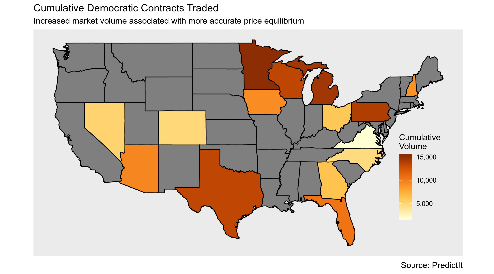
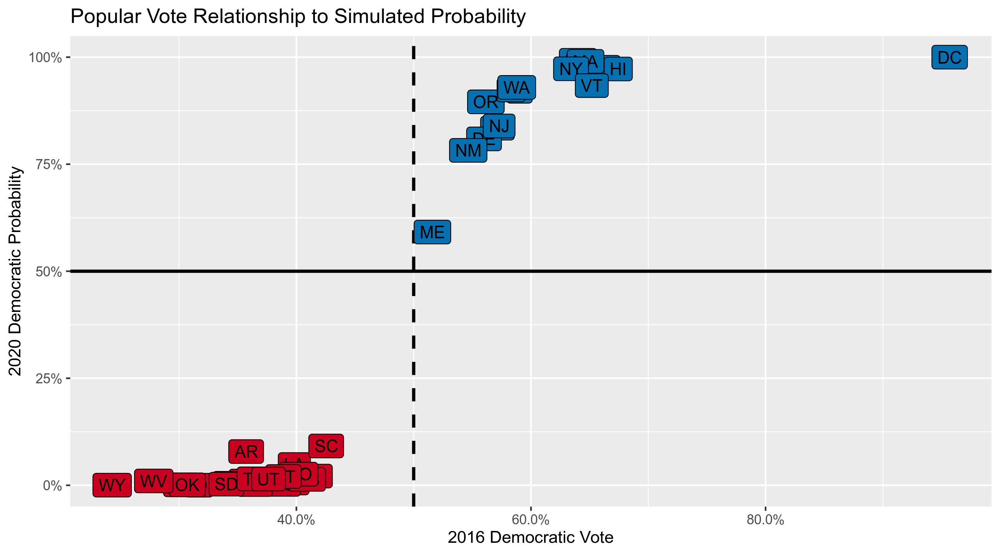
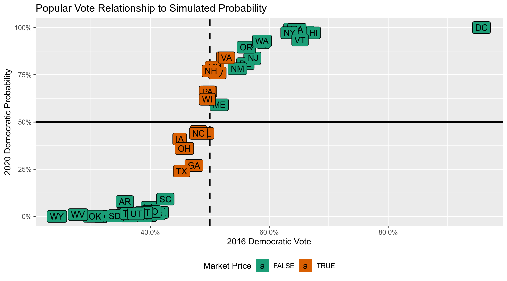
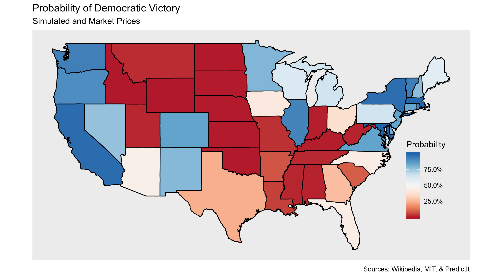
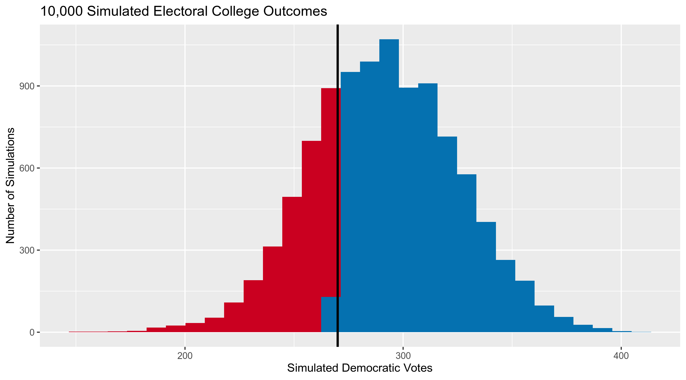

Simulating the 2020 Electoral College With Prediction Markets
================

  - [Background](#background)
  - [Process](#process)
  - [Battleground Data](#battleground-data)
  - [Past Elections](#past-elections)
  - [Probabilities](#probabilities)
  - [Combine Sources](#combine-sources)
  - [Electoral College](#electoral-college)

## Background

Election prediction helps party officials, campaign operatives, and
journalists interpret campaigns in a quantitative manner. Understanding
trends, uncertainty, and likely outcomes is in invaluable political
tool. For this reason, elections will always be predicted. In the
absense of numbers, people will latch on to whatever predictive tool
they can find. The [stock market](https://on.mktw.net/2Zd8QOU), [key
incumbency factors](http://wapo.st/2eUm8cv), the [Washington
Redskins](https://en.wikipedia.org/wiki/Redskins_Rule), [Halloween mask
sales](https://www.thrillist.com/news/nation/halloween-mask-sales-predict-the-presidential-election),
and a [psychic Chinese monkeys](http://wapo.st/2fnlPr3).

In the past few years, as “[big
data](https://en.wikipedia.org/wiki/Big_data)” has sought to supplant
traditional arbitrary punditry, the statistical forecasting model has
become a staple of electioneering. Popularized by the data journalist at
[FiveThirtyEight](https://fivethirtyeight.com/), the forecasting model
is a statistical tool used to incorporate a number of quantitative
inputs and produce a *probabilistic* view of all possible outcomes.

However, following the 2016 Presidential election, much of the public
felt betrayed by the promise of data to seemingly predict the future. As
explained in [*An Evaluation of 2016 Election Polls in the
U.S.*](https://www.aapor.org/Education-Resources/Reports/An-Evaluation-of-2016-Election-Polls-in-the-U-S.aspx)
by the [American Association for Public Opinion
Research’s](https://www.aapor.org/) (AAPOR) Ad Hoc Committee on 2016
Election Polling:

> The 2016 presidential election was a jarring event for polling in the
> United States. Pre-election polls fueled high-profile predictions that
> Hillary Clinton’s likelihood of winning the presidency was about 90
> percent, with estimates ranging from 71 to over 99 percent. When
> Donald Trump was declared the winner of the presidency in the early
> hours of November 9th, it came as a shock even to his own pollsters
> (Jacobs and House 2016). There was (and continues to be) widespread
> consensus that the polls failed.

This “widespread consensus” was expressed by the new President-elect,
vindicated Republican voters, stunned Democratic voters, academics, and
journalists alike. This doubt in the polls was a reasonable knee jerk
reaction on election night, when it became clear Trump would win. Some
even went as far as to [cast the suprise upset as the end of scientific
polling in
America](https://thehill.com/blogs/ballot-box/presidential-races/305133-pollsters-suffer-huge-embarrassment):

> Pollsters and election modelers suffered an industry-shattering
> embarrassment at the hands of Donald Trump on Tuesday night. Trump,
> the Republican presidential nominee, had long said the polls were
> biased against him. His claims — dismissed and mocked by the experts —
> turned out to be true. “It’s going to put the polling industry out of
> business,” said CNN anchor Jake Tapper. “It’s going to put the voter
> projection industry out of business.” Going into Election Day, a
> strong majority of pollsters and election modelers forecast that
> Democrat Hillary Clinton would coast to victory, with many predicting
> she would sweep the battlegrounds and win north of 300 electoral
> votes… Whatever the reason, pollsters will have to reassess after a
> dismal showing in 2016 that produced a result almost no one foresaw.

The ad hoc committee was formed by the industry to explore and respond
to do exactly this: reasses the roll modern polling techniques and
forecasting will play in American election prediction. The report did
not attempt to explain the victory, only examine the reasons why it was
unpredicted. to answer this question, they studied polling datasets
supplimented with sample size and source, target population, survey
mode, and weighting technique for 23 polling organizations. In the
execitve summary of the report, the committee outline its findings:

> **National polls were generally correct and accurate by historical
> standards.** National polls were among the most accurate in estimating
> the popular vote since 1936. Collectively, they indicated that Clinton
> had about a 3 percentage point lead, and they were basically correct;
> she ultimately won the popular vote by 2 percentage points…

However, as Americans have been come astutely aware, the national
popular vote does not determine the winner of a Presidential election.
In *two* of the last Presidential elections, the winner has not been the
candidate which recieved the greatest number of overall votes but the
one who recieved a majority of the votes cast by the 538 members of the
Electoral College. This essentially results in *fifty-one* separate
Presidential contests, each varying in their predictability and
importance in deciding the next leader of the free world. This fact
undermines the confidence the AAPOR expressed in national polling, a
reality the fully acklowedge:

> **State-level polls showed a competitive, uncertain contest…** In the
> contest that actually mattered, the Electoral College, state-level
> polls showed a competitive race in which Clinton appeared to have a
> slim advantage. Eight states with more than a third of the electoral
> votes needed to win the presidency had polls showing a lead of three
> points or less (Trende 2016).\[2\] As Sean Trende noted, “The final
> RealClearPolitics Poll Averages in the battleground states had Clinton
> leading by the slimmest of margins in the Electoral College, 272-266.”
> The polls on average indicated that Trump was one state away from
> winning the election.

And while the report is clear in it’s rebuke of any indiscriminate
dismissal of polling (“A spotty year for election polls is not an
indictment of all survey research or even all polling.”) it still seems
worthwhile to continue contemplation over the state of election
forecasting. Importantly, the report was less decidently supportive over
*probabilistic* forcasts, which incorperate opinon polling but generate
a distinctly different product.

> **About those predictions that Clinton was 90 percent likely to win…**
> However well-intentioned these predictions may have been, they helped
> crystalize the belief that Clinton was a shoo-in for president, with
> unknown consequences for turnout. While a similar criticism can be
> leveled against polls – i.e., they can indicate an election is
> uncompetitive, perhaps reducing some people’s motivation to vote –
> polls and forecasting models are not one and the same. As the late
> pollster Andrew Kohut once noted (2006), “I’m not a handicapper, I’m a
> measurer. There’s a difference.” Pollsters and astute poll reporters
> are often careful to describe their findings as a snapshot in time,
> measuring public opinion when they are fielded… Forecasting models do
> something different – they attempt to predict a future event. As the
> 2016 election proved, that can be a fraught exercise, and the net
> benefit to the country is unclear.

Prediction markets can be used to generate similarly probabilistic views
of election outcomes by utilizing the economic forces of price discovery
and risk aversion to overcome the ideological bias of self-interested
traders on a binary options exchange. Traders use real money to buy
shares of [futures
contracts](https://en.wikipedia.org/wiki/Futures_contract) tied to an
outcome. The price of these shares fluctuates on the market as the
underlying *likelihood* of that outcome changes.
[PredictIt](https://www.predictit.org/) is an exchange for such
contracts, run by Victoria University of Wellington.

Following the 2018 Midterm elections, [I wrote a
paper](https://github.com/kiernann/models-markets) comparing these
markets to the congressional model published by the data journalists at
FiveThirtyEight. I found no statistical difference in the two method’s
ability to make [skilled
predictions](https://en.wikipedia.org/wiki/Brier_score) over the course
of the Midterm elections. In fact, the markets showed reasonable
skepticism in a number of upset elections. Below, you can see how
competitive Congressonal races were predicted by both the markets and
model.


With the 2020 Presidential race well under way, the media, voters,
campaigns, and political scientists alike are all looking for the best
way to provide useful predictions and avoid the pitfalls of 2016. This
far from the General Election, what little polling we have [is less than
useless](https://53eig.ht/2IFHxVW). In the absense of more quantitative
data, can we possibly use prediction markets to generate a useful
probabilistic simulation of the electoral college? today I’ll try and
use data from the PredictIt exchange to answer this question.

## Process

I’ll be using the open source [language R](https://www.r-project.org/)
and packages from the [Tidyverse ecosystem](https://www.tidyverse.org/).

``` r
if (!require("pacman")) install.packages("pacman")
pacman::p_load_current_gh("kiernann/campfin")
#> 
#>   
   checking for file ‘/tmp/Rtmpuzc4Jj/remotes39753100999e/kiernann-campfin-07cbf64/DESCRIPTION’ ...
  
✔  checking for file ‘/tmp/Rtmpuzc4Jj/remotes39753100999e/kiernann-campfin-07cbf64/DESCRIPTION’
#> 
  
─  preparing ‘campfin’:
#> 
  
   checking DESCRIPTION meta-information ...
  
✔  checking DESCRIPTION meta-information
#> 
  
─  checking for LF line-endings in source and make files and shell scripts
#> 
  
─  checking for empty or unneeded directories
#> ─  looking to see if a ‘data/datalist’ file should be added
#> 
  
─  building ‘campfin_0.0.0.9003.tar.gz’
#> 
  
   
#> 
pacman::p_load(tidyverse, dataverse, magrittr, jsonlite, scales, rvest)
```

Throughout this simulation, I’ll be using only the Democratic party
market prices, popular vote, and probability. It’s difficult to
determine the winner of an election from a single party’s share of the
popular vote, as only a plurality and not a majority of votes is
required. This means we can’t directly test if a party recieves \>50% of
the vote to determine if they’ve won, as some winners recieve less than
50% of the vote. We can get around this by looking at only votes cast
for the major parties (Democrats and Republicans); if a party wins \>50%
of the major party vote, we can pretty safely assume they’ve won the
plurality of votes. This is a reductive, but makes this quick and dirty
simulation a lot easier. A more professional model would fully
incorperate third-party voters, which \[can affect elections\]\[09\].

## Battleground Data

PredictIt hosts markets for most of the competitive battleground states.
We can scrape these markets using their API and the
`jsonlite::fromJSON()` function.

``` r
market_prices <-
  # query predictit api
  fromJSON(txt = "https://www.predictit.org/api/marketdata/all/") %>%
  # use markets tree
  use_series(markets) %>%
  # keep only battleground markets
  filter(str_detect(name, "Which party will win (.*) in the 2020 presidential election?")) %>%
  # expose contracts nests has new rows
  unnest(contracts, names_repair = "unique") %>%
  # keep only dem contracts
  filter(shortName...11 == "Democratic") %>%
  # select state and latest price
  select(state = shortName...3, price = lastTradePrice) %>%
  # extract state abbreviation from question
  mutate(state = str_extract(state, "[:upper:]{2}")) %>% 
  arrange(price)
```

From this API, we get probability data for 15 battleground states.

<!-- -->

We should note the trading volume of each market. Higher volume is
typically associated with a more accurate price equilibrium. That is,
the more people trade on the market the more accurate the prediction
will be. We can get this data by downloading the 90 day history of each
market.

<!-- -->

## Past Elections

These states alone aren’t enough to simulate the 2020 electoral college.
To predict the remaining states, we have a few options. The easiest
route is to simply assume the party which won in 2016 will win again in
2020. This isn’t neccesarily a terrible idea, as the majority of states
rarely flip, especially not the 35 states without a prediction market.
We can start from this assumption and improve upon it very easily.

To calculate some simple probablistic predictions for the remaining
states, we will use data from the MIT Election Data and Science Lab,
which has a database of popular vote results in each state for every
Presidential election since 1976. This file can be read using
`dataverse::get_file()`.

``` r
past_elections <-
  # get MIT dataverse file
  get_file(
    file = "1976-2016-president.tab", 
    dataset = "doi:10.7910/DVN/42MVDX",
  ) %>%
  # parse raw as data frame
  read_csv(col_types = cols()) %>% 
  rename(votes = candidatevotes) %>%
  # keep only major candidates
  filter(writein == FALSE) %>% 
  filter(party %in% c("democrat", "republican")) %>% 
  # calculate dem share of major vote
  group_by(year, state_po) %>% 
  mutate(share = votes/sum(votes)) %>%
  # keep only dems
  filter(party == "democrat") %>% 
  select(year, state = state_po, share)

# MIT Election Data and Science Lab, 2017, "1976-2016-president.tab"
# https://doi.org/10.7910/DVN/42MVDX/MFU99O, Harvard Dataverse, V5
```

This historical data provides the two statistics needed to finish our
probablistic simulation.

First, we have the democratic share of the vote in the last election.
This statistic is the default assumption for our 2020 simulation.

``` r
last_election <- past_elections %>%
  # keep only last election
  filter(year == 2016)
```

<!-- -->

Second, we can calculate the variation in the party’s share of the vote
in the last 11 elections. This statistic allows us to introduce
uncertainty to our assumption. The greater the historical variation, the
less certain we can be that the winner of the *last* election will win
the *next* election.

``` r
state_sd <- past_elections %>% 
  # calculate state std dev
  group_by(state) %>% 
  summarize(sd = sd(share))
```

<!-- -->

## Probabilities

Any good election forecast needs to be *probabilistic*. Professional
forecasts take this division of votes (usually from an aggregate of
polls) then calculate the probability distribution around that division
using a series of other factors.

For this simulation, we already have probabilities for 15 states.
PredictIt only hosts markets for the most competitive states. The
reality is, the other 36 contests are fairly noncompetitive. From the
density plot below, we can see how the 2016 popular vote differed for
those states *with* 2020 markets and those without.

<!-- -->

To turn these Democratic share statistics for less competitive states
into probabilities of Democratic victory, we simply have to add our
calculated historical standard deviation and generate 10,000 random
observations from a normal distribution using `rnorm()` with our mean
set to the 2016 share.

``` r
last_election <- last_election %>%
  # add state std devs
  left_join(state_sd) %>%
  rowwise() %>%
  # calculate win rate of simulations
  mutate(prob = mean(rnorm(10000, share, sd) > 0.50)) %>% 
  ungroup()
```

If we visualize this process, we can see how the 2016 result and a
standard deviation is used to simulate many elections and calculate a
probability.

Below you can see the results of 1,000 simulated elections in Vermont,
which saw 65.2% of votes were cast for the Democratic candidate in the
last election, but has a historical standard deviation of 0.1, we can
generate 1000 new elections from our random normal distribution. Any
simulated election with a share of the major party vote greater than 50%
is considered a Democratic victory. The percentage of those simulated
elections won is the *probability* of a Democrat winning the next
election.

<!-- -->

Now, lets see the distribution of 1,000 simulated elections in
Pennsylvania, a much closer election, where only 49.4% of voters
supported the democratic candidate but where the historical standard
deviation is much lower at 0.033. You can see how the number of
elections below and above 50% is more equal, meaning our simulated
probability is much closer to 50%. This is a state where we will use a
prediction market.

<!-- -->

We can generate this probability by calculating the average number of
simulated elections won by the democrat. Below, we see how this is done
by simulating the Connecticut election 60 times.

``` r
# find std dev
(ex_past <- round(past_elections$share[past_elections$state == "CT"], digits = 3))
#>  [1] 0.474 0.444 0.390 0.474 0.541 0.604 0.593 0.553 0.613 0.588 0.571
(ex_sd <- sd(ex_past))
#> [1] 0.0743482
# find last share
(ex_share <- last_election$share[last_election$state == "CT"])
#> [1] 0.5714155
# simulate 60 elections
(ex_sims <- round(x = rnorm(n = 60, mean = ex_share, sd = ex_sd), digits = 3))
#>  [1] 0.538 0.626 0.534 0.585 0.491 0.596 0.549 0.486 0.458 0.596 0.508 0.471 0.536 0.602 0.518
#> [16] 0.524 0.764 0.630 0.394 0.518 0.565 0.494 0.464 0.566 0.670 0.580 0.531 0.632 0.558 0.550
#> [31] 0.648 0.603 0.590 0.543 0.481 0.616 0.614 0.608 0.680 0.509 0.559 0.523 0.575 0.454 0.499
#> [46] 0.793 0.500 0.571 0.501 0.606 0.694 0.594 0.506 0.542 0.669 0.539 0.506 0.399 0.361 0.707
# check for win each each
(ex_wins <- ex_sims > 0.5)
#>  [1]  TRUE  TRUE  TRUE  TRUE FALSE  TRUE  TRUE FALSE FALSE  TRUE  TRUE FALSE  TRUE  TRUE  TRUE
#> [16]  TRUE  TRUE  TRUE FALSE  TRUE  TRUE FALSE FALSE  TRUE  TRUE  TRUE  TRUE  TRUE  TRUE  TRUE
#> [31]  TRUE  TRUE  TRUE  TRUE FALSE  TRUE  TRUE  TRUE  TRUE  TRUE  TRUE  TRUE  TRUE FALSE FALSE
#> [46]  TRUE FALSE  TRUE  TRUE  TRUE  TRUE  TRUE  TRUE  TRUE  TRUE  TRUE  TRUE FALSE FALSE  TRUE
# calculate percent of wins
mean(ex_wins)
#> [1] 0.7833333
```

Below, you can see how the 2016 vote results result in more extreme
probabilities.

<!-- -->

This relationship depends entirely on our chosen standard deviation.
Again, since we are only simulating probabilities for those states
*without* markets, these probabilities tend to be extreme.

<!-- -->

## Combine Sources

The efficient market hypothesis holds that our markets are a more
accurate method to generate probabilistic predictions. We will uses
these market prices over our simulated elections where we have them.

``` r
state_probs <- last_election %>%
  # add market prices
  left_join(market_prices, by = "state") %>%
  # combine probabilities
  mutate(
    prob = coalesce(price, prob),
    market = !is.na(price)
  ) %>%
  select(state, share, sd, prob, market)
```

<!-- -->

We now have probabilities for all 51 electoral contests\!

<!-- -->

However, this map does not paint the most accurate picture of the
election. Presidential elections are of course conducted with the
electoral college, where each state’s value is different.

## Electoral College

To simulate the electoral college from these probabilities, we of course
still need to know how many electoral votes are up for grabs in each
state. We can get this number directly from the National Archive and
Records Administration, the federal agency tasked with overseeing the
electoral college.

``` r
college_votes <- 
  # read archive.gov website
  read_html("https://www.archives.gov/federal-register/electoral-college/allocation.html") %>% 
  html_nodes("table") %>% 
  # extract table as tibble
  html_table(fill = TRUE) %>% 
  extract2(5) %>% as_tibble() %>%
  # format for join
  set_names(c("state", "votes")) %>% 
  mutate(state = abbrev_state(state))
```

We can then add these votes to our data frame of probabilities.

``` r
college_probs <- left_join(state_probs, college_votes, by = "state")
arrange(college_probs, desc(votes))
#> # A tibble: 51 x 6
#>    state share     sd  prob market votes
#>    <chr> <dbl>  <dbl> <dbl> <lgl>  <int>
#>  1 CA    0.661 0.0838 0.976 FALSE     55
#>  2 TX    0.453 0.0450 0.24  TRUE      38
#>  3 FL    0.494 0.0614 0.44  TRUE      29
#>  4 NY    0.634 0.0701 0.973 FALSE     29
#>  5 IL    0.590 0.0640 0.920 FALSE     20
#>  6 PA    0.496 0.0334 0.66  TRUE      20
#>  7 OH    0.457 0.0405 0.36  TRUE      18
#>  8 GA    0.473 0.0809 0.27  TRUE      16
#>  9 MI    0.499 0.0545 0.66  TRUE      16
#> 10 NC    0.481 0.0479 0.44  TRUE      15
#> # … with 41 more rows
```

To simulate the entire electoral college, we simple have to perform the
same `sample()` process as we did with Connecticut above. To simplify
this process, we can create a new `sim_race()` function that takes a
probability and returns `TRUE` or `FALSE` indicating whether or not the
democrat has won.

``` r
sim_race <- function(dem = 1-rep, rep = 1-dem) {
  sample(
    size = 1,
    x = c(TRUE, FALSE),
    prob = c(dem, rep)
  )
}
```

If we call this function 100 times on a race with a Democratic
probability of 75% then we should get 75 democratic victories. The more
times we run this function, the closer to 75% of the races the Democrat
will win.

``` r
ex_sim <- rep(NA, 100)
for (i in 1:100) {
  ex_sim[i] <- sim_race(dem = 0.75)
}
print(ex_sim)
#>   [1]  TRUE FALSE FALSE  TRUE  TRUE  TRUE FALSE  TRUE  TRUE  TRUE FALSE  TRUE  TRUE  TRUE  TRUE
#>  [16]  TRUE FALSE  TRUE  TRUE  TRUE  TRUE  TRUE FALSE FALSE  TRUE  TRUE  TRUE  TRUE  TRUE  TRUE
#>  [31] FALSE FALSE  TRUE FALSE  TRUE FALSE FALSE  TRUE  TRUE FALSE  TRUE FALSE  TRUE FALSE FALSE
#>  [46]  TRUE  TRUE FALSE  TRUE  TRUE FALSE  TRUE  TRUE FALSE  TRUE  TRUE  TRUE FALSE FALSE  TRUE
#>  [61] FALSE  TRUE  TRUE  TRUE FALSE  TRUE FALSE  TRUE FALSE  TRUE  TRUE  TRUE  TRUE  TRUE  TRUE
#>  [76]  TRUE FALSE  TRUE FALSE  TRUE FALSE  TRUE FALSE  TRUE  TRUE  TRUE  TRUE  TRUE  TRUE  TRUE
#>  [91]  TRUE  TRUE  TRUE  TRUE FALSE  TRUE  TRUE  TRUE  TRUE  TRUE
mean(ex_sim)
#> [1] 0.7
```

With this function, we can also simulate every state in the country at
once and count the number of electoral college votes won by each party.

``` r
ex_sim <- map_lgl(college_probs$prob, sim_race)
sum(college_probs$votes[ex_sim])
#> [1] 285
```

To best understand the *range* of possible outcomes, we can perform the
same simulation many times.

``` r
n <- 10000
sims <- rep(NA, n)
for (i in seq(1, n)) {
  state_outcomes <- map_lgl(college_probs$prob, sim_race)
  dem_total <- sum(college_probs$votes[state_outcomes])
  sims[i] <- dem_total
}
```

From the summary below, we see a picture of an election where the
Democratic party holds a significant lead. Of our 10,000 simulations,
the Democrats won 73.8% with the modal outcome being a victory of 290
electoral college votes.

``` r
# summary of simulations
summary(sims)
#>    Min. 1st Qu.  Median    Mean 3rd Qu.    Max. 
#>   150.0   268.0   291.0   291.4   314.0   408.0
# probability of dem victory
mean(sims > 269)
#> [1] 0.7384
```

<!-- -->
