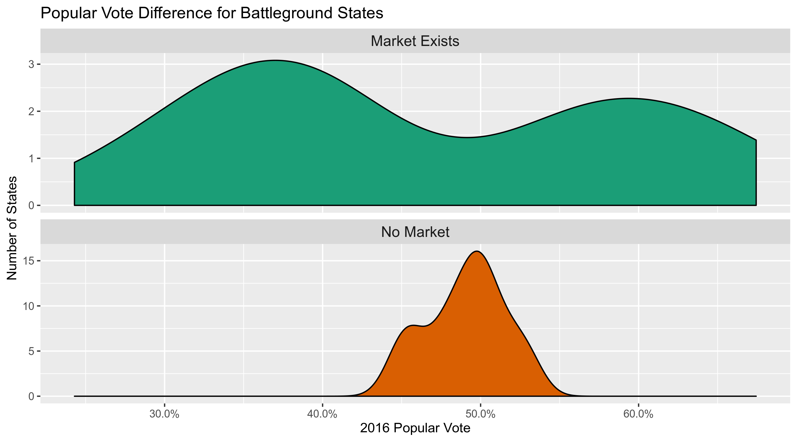
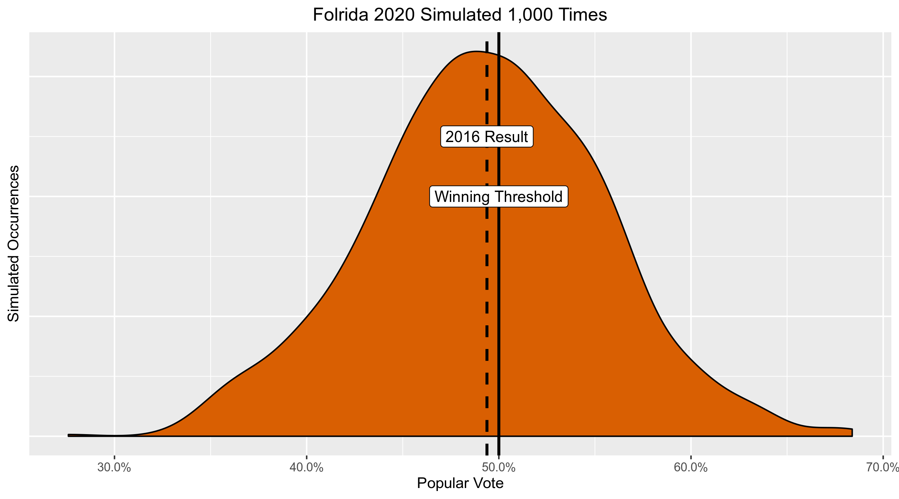
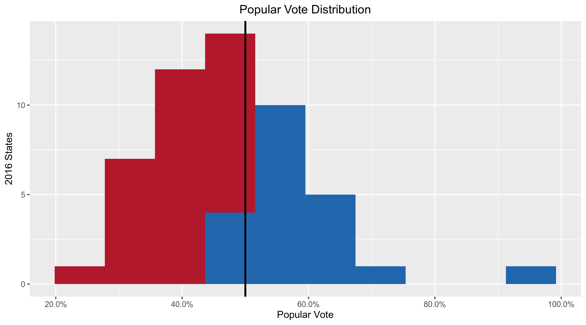

Simulating the 2020 Election With Markets
================

  - [Code](#code)
  - [Market Data](#market-data)
  - [Past Data](#past-data)
  - [Probabilities](#probabilities)
  - [Combine Sources](#combine-sources)
  - [Electoral College](#electoral-college)

Election prediction helps party officials, campaign operatives, and
journalists interpret campaigns in a quantitative manner. In the past
few years, the forecasting model has become a staple of political
punditry as big data has sought to supplant arbitrary punditry.
Popularized by the data journalist at FiveThirtyEight, the forecasting
model is a statistical tool used to incorporate a number of quantitative
inputs and produce a *probabilistic* view of all possible outcomes.

However, following the 2016 Presidential election, the public
([wrongly](http://53eig.ht/2fIYJK2)) felt betrayed by promise of data to
predict the future. This left political scientists and journalists alike
reassessing other predictive tools. My favorite of these alternatives is
the prediction market.

Prediction markets can be used to generate similarly probabilistic views
of election outcomes by utilizing the economic forces of price discovery
and risk aversion to overcome the ideological bias of self-interested
traders on a binary options exchange. Traders use real money to buy
shares of [futures
contracts](https://en.wikipedia.org/wiki/Futures_contract) tied to an
outcome. The price of these shares fluctuates on the market as the
underlying *likelihood* of that outcome changes.
[PredictIt](https://www.predictit.org/) is an exchange for such
contracts, run by Victoria University of Wellington.

Following the 2018 Midterm elections, [I wrote a
paper](https://github.com/kiernann/models-markets) comparing these
markets to the congressional model published by the data journalists at
FiveThirtyEight. I found no statistical difference in the two method’s
ability to make [skilled
predictions](https://en.wikipedia.org/wiki/Brier_score) over the course
of the Midterm elections. In fact, the markets showed reasonable
skepticism in a number of upset elections.


With the 2020 Presidential race well under way, the media, voters,
campaigns, and political scientists alike are all looking for the best
way to provide useful predictions and avoid the pitfalls of 2016. This
far from the General Election, what little polling we have [is less than
useless](https://53eig.ht/2IFHxVW). In the absense of more quantitative
data, can we possibly use prediction markets to generate a useful
probabilistic simulation of the electoral college? today I’ll try and
use data from the PredictIt exchange to answer this question.

## Code

I’ll be using the open source [language R](https://www.r-project.org/)
and packages from the [Tidyverse ecosystem](https://www.tidyverse.org/).

``` r
if (!require("pacman")) install.packages("pacman")
pacman::p_load_current_gh("kiernann/campfin")
pacman::p_load(
  tidyverse,
  magrittr,
  jsonlite,
  janitor,
  scales,
  rvest,
  usmap
)
```

## Market Data

PredictIt hosts markets for most of the competitive battleground states.
We can scrape these markets using their API and the
`jsonlite::fromJSON()` function.

``` r
market_prices <-
  fromJSON(txt = "https://www.predictit.org/api/marketdata/all/") %>%
  use_series(markets) %>%
  filter(str_detect(name, "Which party will win (.*) in the 2020 presidential election?")) %>%
  unnest(contracts, names_repair = make_clean_names) %>%
  filter(short_name_2 == "Democratic") %>%
  select(state = short_name, price = last_close_price) %>%
  mutate(state = str_extract(state, "[:upper:]{2}")) %>% 
  arrange(price)
```

From this API, we get probability data for 15 battleground states.

<!-- -->

These states alone aren’t enough to simulate the electoral college in
2020. To predict the remaining states, we have a few options. The
easiest route is to simply assume the party which won in 2016 will win
again in 2020. This isn’t a terrible idea, as the majority of states
rarely flip, especially not the 35 states without a prediction market.
We can start from this assumption and improve upon it very easily.

## Past Data

We can scrape the 2016 election results from Wikipedia, where we can
find the percentage of the popular vote as well as the number of
electoral college votes up for grab in each state.

``` r
past_results <-
  # scrape table
  read_html("https://en.wikipedia.org/wiki/2016_United_States_presidential_election") %>%
  html_node("table.wikitable:nth-child(1)") %>%
  html_table(fill = TRUE) %>%
  na_if("–") %>%
  as_tibble(.name_repair = "unique") %>%
  # select columns and rows
  select(1, 3, 5, 6, 8) %>%
  slice(-1, -58, -59) %>%
  set_names(c("state", "dem", "dem_votes", "rep", "rep_votes")) %>%
  # parse numeric cols
  map_dfc(parse_guess) %>%
  mutate(
    # coalesce EC votes won by both
    votes = coalesce(dem_votes, rep_votes),
    # calculate the dem share
    dem_prop = dem/(dem + rep),
    # abbreviate the state names
    state = state %>% 
      str_remove("\\(at-lg\\)") %>% 
      str_remove(",\\s\\d..$") %>% 
      abrev_state()
  ) %>% 
  # use mean for ME and NE
  group_by(state) %>% 
  summarize(
    past = mean(dem_prop),
    votes = sum(votes)
  )
```

<!-- -->

## Probabilities

Any good election forecast needs to be *probabilistic*. Professional
forecasts take this division of votes (usually from an aggregate of
polls) then calculate the probability distribution around that range
with a series of other factors.

For this simulation, we already have probabilities for 15 states.
PredictIt only hosts markets for the most competitive states. The
reality is, the other 36 contests are fairly noncompetitive. From the
density plot below, we can see how the 2016 popular vote differed for
those states *with* 2020 markets and those without.

<!-- -->

For those states without a market, we need to convert these vote shares
to probabilities. In reality, a even a 5% edge results in a significant
advantage and a probability difference much greater than 5%.

To make this conversion, we simulate many new election using the 2016
result. These simulated elections are normally distributed around the
2016 results with a standard deviation of 0.5 to account for the
uncertainty that’s developed in the last 3 years. Below you can see the
results of 1,000 simulated elections in Maryland, which voted 64.0% for
the Democratic candidate in the last election. The area under the curve
past 50% is the *probability* of a democrat winning again in the next
election.

<!-- -->

Now, lets see the distribution of 1,000 simulated elections in Florida,
a much closer election with only 49.4% of voters supporting the
democratic candidate.

<!-- -->

We can generate this probability by calculating the average number of
simulated elections won by the democrat. Below, we see how this is done
by simulating the Connecticut election 30 times.

``` r
(ex_past <- past_results$past[past_results$state == "CT"])
#> [1] 0.5714155
(ex_sims <- round(x = rnorm(n = 30, mean = ex_past, sd = 0.05), digits = 4))
#>  [1] 0.6491 0.5383 0.5766 0.5286 0.5049 0.4915 0.5976 0.6158 0.6076 0.5793 0.4978 0.6854 0.6533
#> [14] 0.5576 0.5244 0.6229 0.5843 0.5950 0.5569 0.5935 0.5326 0.4771 0.5352 0.5523 0.5018 0.6710
#> [27] 0.6084 0.5719 0.6707 0.6144
(ex_wins <- ex_sims > 0.5)
#>  [1]  TRUE  TRUE  TRUE  TRUE  TRUE FALSE  TRUE  TRUE  TRUE  TRUE FALSE  TRUE  TRUE  TRUE  TRUE
#> [16]  TRUE  TRUE  TRUE  TRUE  TRUE  TRUE FALSE  TRUE  TRUE  TRUE  TRUE  TRUE  TRUE  TRUE  TRUE
mean(ex_wins)
#> [1] 0.9
```

We can perform such random normal simulations for *every* state. We’ll
generate *10,000* simulated elections and calculate the percent of those
simulated elections where the democrat won.

``` r
past_results <- mutate(past_results, prob = NA)
for (i in seq_along(past_results$state)) {
  sims <- rnorm(n = 10000, mean = past_results$past[i], sd = 0.05)
  past_results$prob[i] <- mean(sims > 0.5)
}
```

Below, you can see how the 2016 vote results result in more extreme
probabilities.

<!-- -->

<!-- -->

This relationship depends entirely on our chosen standard deviation.
Again, since we are only simulating probabilities for those states
*without* markets, these probabilities tend to be extreme.

<!-- -->

## Combine Sources

The efficient market hypothesis holds that our markets are a more
accurate method to generate probabilistic predictions. We will uses
these market prices over our simulated elections where we have them.

``` r
ec <- past_results %>% 
  left_join(market_prices, by = "state") %>% 
  mutate(
    dem = coalesce(price, prob),
    market = !is.na(price)
  ) %>% 
  select(state, dem, market, votes)
```

<!-- -->

<!-- -->

## Electoral College

To simulate the entire electoral college, we simple have to perform the
same `sample()` process as we did with Connecticut, above. To simplify
this process, we can create a new `sim_race()` function that takes a
probability and returns a `TRUE` or `FALSE` indicating whether or not
the democrat has won.

``` r
sim_race <- function(dem = 1-rep, rep = 1-dem) {
  sample(
    size = 1,
    x = c(TRUE, FALSE),
    prob = c(dem, rep)
  )
}
```

With this function, we can simulate every state in the country and count
the number of electoral college votes won by each party.

``` r
sim1 <- map_lgl(ec$dem, sim_race)
sum(ec$votes[sim1])
#> [1] 256
```

``` r
sim1_result <- if_else(
  condition = sum(ec$votes[sim1]) > 269,
  true = "the Democrats did win",
  false = "the Democrats did not win"
)
```

In the above election, .

To best understand the *range* of possible outcomes, we can perform the
same simulation many times.

``` r
n <- 10000
sims <- rep(NA, n)
for (i in seq(1, n)) {
  state_outcomes <- map_lgl(ec$dem, sim_race)
  dem_total <- sum(ec$votes[state_outcomes])
  sims[i] <- dem_total
}
```

From the summary below, you can see a picture of a very close race with
the Democrats holding a slight lead. Of our 10,000 simulations, the
Democrats won 75.7% with the modal outcome being a victory of 281
electoral college votes.

``` r
summary(sims)
#>    Min. 1st Qu.  Median    Mean 3rd Qu.    Max. 
#>   193.0   270.0   290.0   291.4   312.0   405.0
mean(sims > 269)
#> [1] 0.757
```

<!-- -->
